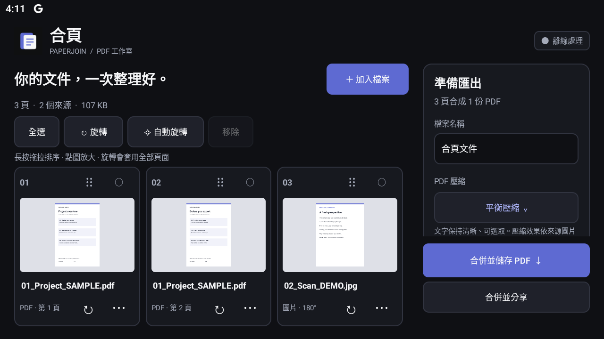
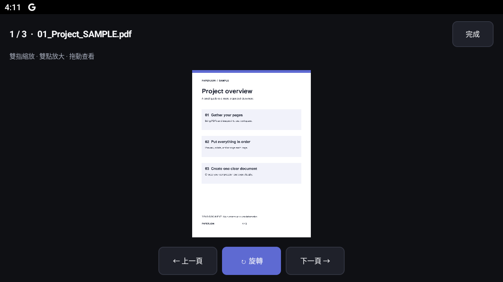

# 合頁 PaperJoin

離線 Android PDF 工作室：把 PDF 與圖片整理成一份清晰、順序正確的文件。

[下載最新 APK](https://github.com/gujiu502/paperjoin-android/releases/latest) · [自動發布狀態](https://github.com/gujiu502/paperjoin-android/actions/workflows/release.yml)

## 介面

以下為 BlueStacks Android 11 的實際畫面，文件均為專門製作的示範資料。




## 功能

- **批量加入**：多份 PDF 合併、PDF 混入照片、照片單獨合成 PDF。透過系統檔案選擇器多選 PDF、JPG、PNG、WebP，也能從其他 App 分享檔案進來。
- **逐頁預覽**：縮圖、全螢幕預覽、雙指縮放、雙點放大。
- **手動旋轉**：單頁、選取頁面或全部頁面，每次順時針 90°。
- **自動旋轉**：PDF 優先分析文字方向；掃描件與圖片使用內建中英文 OCR 判讀。文字太少、直排或方向不明時保持原樣，交由使用者檢查。
- **拖拉排列**：長按頁面拖拉；頁面選單也能移到最前／最後。可選取後批量移除。
- **PDF 壓縮**：原始品質、平衡壓縮、最小檔案。壓縮內嵌圖片，保留 PDF 的文字與向量。
- **儲存與分享**：自訂檔名、選擇儲存位置、分享合併結果；工作區會在本機保存。

## 使用

1. 安裝 [Releases](https://github.com/gujiu502/paperjoin-android/releases) 中的 `PaperJoin-版本.apk`（Android 6.0 以上）。
2. 點「加入檔案」。在系統選擇器長按檔案即可多選。
3. 點縮圖放大檢查，長按拖拉排序；未選取頁面時，工具列旋轉會套用全部頁面。
4. 選擇壓縮模式及檔名，點「合併並儲存 PDF」。手機直向畫面從底部「匯出設定與壓縮」進入。

文件在裝置內處理，App 沒有網路權限，不會上傳來源檔案，也不需要登入。

曾安裝本專案 Debug 版的裝置，改裝正式版前需先匯出要保留的文件，再移除 Debug 版；兩種版本的簽章不同。

## 壓縮與支援範圍

| 模式 | 圖片處理 |
| --- | --- |
| 原始品質 | 保留 JPEG 原始資料；其他圖片使用無損編碼 |
| 平衡壓縮 | 適用圖片最長邊約 2400 px，JPEG 品質 82% |
| 最小檔案 | 適用圖片最長邊約 1280 px，JPEG 品質 58% |

壓縮效果依原稿而定；已經壓縮的 PDF 不保證再縮小。PDF 中帶透明遮罩、特殊色彩空間或超大點陣圖會保留，避免錯誤重編碼。圖片的 EXIF 方向及鏡像會正確套用。

單一來源上限 250 MB、單一 PDF 最多 500 頁、每次匯出最多 500 頁。加密／密碼保護的 PDF 請先解密。合併以頁面內容為主，不保留原檔的數位簽章有效性、書籤結構或完整互動表單行為。

## 本機建置

使用 JDK 17、Android SDK 35 和專案內的 Gradle Wrapper。

```powershell
# Windows；local.properties 需指向自己的 Android SDK
.\build.ps1

# 安裝測試版到指定 BlueStacks
adb connect 127.0.0.1:5555
.\build.ps1 -Install -Serial 127.0.0.1:5555
```

```bash
./gradlew assembleDebug lintDebug
```

Debug APK：`app/build/outputs/apk/debug/app-debug.apk`。

## 自動 Release

推送符合 `vMAJOR.MINOR.PATCH` 的標籤，即會自動檢查、建置、簽章及發布 GitHub Release，包含 APK 和 SHA-256 校驗檔。

```bash
git tag v1.0.1
git push origin v1.0.1
```

`versionName` 使用標籤版本，`versionCode = major × 1,000,000 + minor × 1,000 + patch`；每一段限制 0–999。後續發布請使用遞增版本。

維護者需在 Repository Secrets 設定 `ANDROID_KEYSTORE_BASE64`、`ANDROID_KEYSTORE_PASSWORD`、`ANDROID_KEY_ALIAS`、`ANDROID_KEY_PASSWORD`。固定簽章讓後續版本能覆蓋更新；金鑰不得提交到 Git。

本機正式建置可用同名環境變數（檔案路徑使用 `ANDROID_KEYSTORE_PATH`），或建立已忽略的 `.signing/signing.properties`：

```properties
storeFile=.signing/release.jks
storePassword=YOUR_PASSWORD
keyAlias=YOUR_ALIAS
keyPassword=YOUR_PASSWORD
```

```bash
./gradlew assembleRelease -PversionName=1.0.1
```

## 驗證

裝置測試涵蓋混合匯入、實際長按拖拉與頁序保存、旋轉、文字保留、實際圖片壓縮、PNG 透明度、8 種 EXIF 方向、損壞／加密檔案拒絕、中英文方向辨識及中斷寫入的備份恢復。

```powershell
.\build.ps1 -Task assembleDebug,assembleDebugAndroidTest
adb -s 127.0.0.1:5555 install -r app/build/outputs/apk/debug/app-debug.apk
adb -s 127.0.0.1:5555 install -r app/build/outputs/apk/androidTest/debug/app-debug-androidTest.apk
adb -s 127.0.0.1:5555 shell am instrument -w com.paperjoin.app.test/android.test.InstrumentationTestRunner
```

自動 Release 執行 Lint 與正式建置；上述需要裝置的測試在本機執行。`scripts/make_demo.py` 可用 PyMuPDF 和 Pillow 產生示範文件。

`UiWorkflowTest` 暫時使用示範工作區、擷取介面，再還原原有工作區；不會刪除來源檔案。測試完成後的截圖在裝置的 `Android/data/com.paperjoin.app/files/qa/`。

## 技術

Java 原生 Android 介面、RecyclerView / ItemTouchHelper、系統 PdfRenderer、[PDFBox-Android](https://github.com/TomRoush/PdfBox-Android) 與 [ML Kit 文字辨識](https://developers.google.com/ml-kit/vision/text-recognition/v2/android)。
